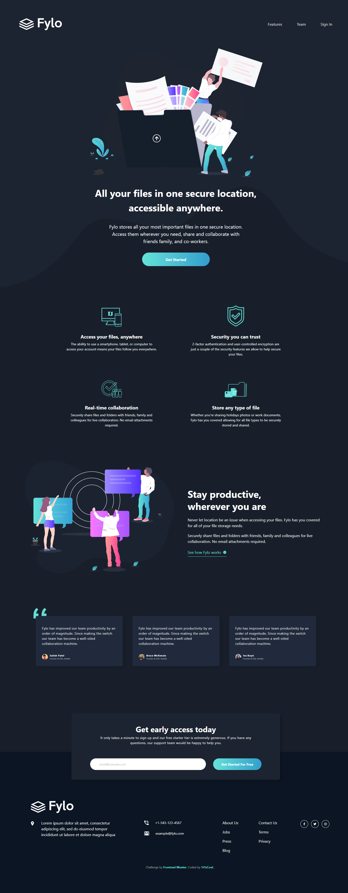
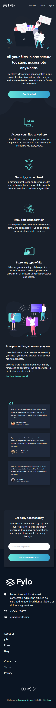

# Frontend Mentor - Fylo dark theme landing page solution

This is a solution to the [Fylo dark theme landing page challenge on Frontend Mentor](https://www.frontendmentor.io/challenges/fylo-dark-theme-landing-page-5ca5f2d21e82137ec91a50fd). Frontend Mentor challenges help you improve your coding skills by building realistic projects.

## Table of contents

- [Overview](#overview)
    - [The challenge](#the-challenge)
    - [Screenshot](#screenshot)
    - [Links](#links)
- [My process](#my-process)
    - [Built with](#built-with)
    - [What I learned](#what-i-learned)
- [Development](#development)
- [Author](#author)

## Overview

### The challenge

Users should be able to:

- View the optimal layout for the site depending on their device's screen size (375px / 1440px designs, responsive from 320px)
- See hover states for all interactive elements on the page
- Receive an error message with the "Get early access" form when the email field is empty or the email is not formatted correctly

### Screenshot

| Desktop                              | Mobile                             |
| ------------------------------------ | ---------------------------------- |
|  |  |

### Links

- Solution URL: [Vercel](https://fylo-dark-theme-landing-page-master-orcin-xi.vercel.app/)
- Live Site URL: [mmalabugin.ru/FyloDarkThemeLandingPage](https://mmalabugin.ru/FyloDarkThemeLandingPage/)

## My process

### Built with

- Semantic HTML5 markup
- CSS custom properties, Flexbox and CSS Grid
- [SolidJS](https://www.solidjs.com/) + TypeScript + [Vite](https://vite.dev/) (`solid-ts` template)
- Local variable fonts (Raleway, Open Sans) with `font-display: optional` and preloads to avoid layout shift
- Pixel-perfect layout: the design JPGs were overlaid on the rendered page with `mix-blend-mode: difference`, and anchor positions were measured programmatically (canvas pixel scans vs `getBoundingClientRect`) until deltas dropped to ~0 — page heights match the designs exactly (3619px desktop, 4519px mobile)

### What I learned

- Solid components run **once**; reactivity lives in signals (`createSignal`) and flows straight into the DOM — no re-renders, no dependency arrays. The email validation in `Cta.tsx` is the only stateful piece.
- Props must not be destructured (getters lose reactivity), `class` instead of `className`, `onInput` for per-keystroke events (`onChange` is native, fires on blur), `<Show>`/`<For>` for control flow.
- `width`/`height` attributes on `` need `height: auto` in CSS once the width is constrained, otherwise the image is stretched.
- The curvy hero-to-main transition is the `bg-curvy-*.svg` (fill = main background color) pinned to the bottom of the Navy-850 hero band.
- On desktop the CTA card overlaps the footer by 116px (negative `margin-bottom`); the footer background boundary is almost invisible against the card, so it was located by scanning the design's pixel colors.

## Development

```bash
npm install
npm run dev     # http://localhost:5173
npm run build   # tsc -b && vite build → dist/
```

Deploy convention: `main` targets Vercel (the `base` line in `vite.config.ts` stays commented). The `deploy` branch enables `base: '/FyloDarkThemeLandingPage/'` and is built by Jenkins into a Docker image (nginx) deployed to Kubernetes behind the shared Traefik ingress (`ingresses` repo).

## Author

- Website - [mmalabugin.ru](https://mmalabugin.ru/)
- Frontend Mentor - [@1t1sCooL](https://www.frontendmentor.io/profile/1t1sCooL)
- Twitter - [@vi_el_mar](https://www.twitter.com/vi_el_mar)
- Telegram - [@ItIsCooL](https://t.me/ItIsCooL)
